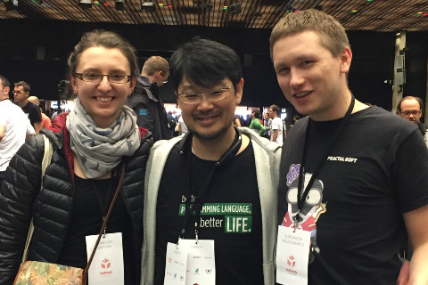
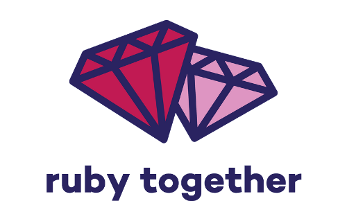

name: inverse
layout: true
class: center, middle

---

# Why do I like Ruby?

.footnote[[Alex Malaszkiewicz](http://github.com/torrocus), Developer at [Fractal Soft](http://fractalsoft.org)]

---

## Timeline of programming languages

---

#### Pre-1950 (9 positions)
```
| Year    | Name                       | Preprocessor        |
+---------+----------------------------+---------------------+
| 1943-45 | Plankalkül (Plan Calculus) |                     |
| 1943-46 | ENIAC coding system        |                     |
| 1946    | ENIAC Short Code           | ENIAC coding system |
```

#### 1950s (49 positions)
```
| Year    | Name                       | Preprocessor        |
+---------+----------------------------+---------------------+
| 1950    | Short Code                 | Brief Code          |
| ...     | ...                        | ...                 |
| 1957    | Fortran I                  | FORTRAN             |
| 1959    | LISP                       | IPL                 |
```

#### 1960s (54 positions)
```
| Year    | Name                       | Preprocessor        |
+---------+----------------------------+---------------------+
| 1960    | COBOL 61                   | FLOW-MATIC, COMTRAN |
| ...     | ...                        | ...                 |
| 1964    | BASIC                      | FORTRAN II, JOSS    |
| 1968    | LOGO                       | LISP                |
| 1969    | B                          | BCPL                |
```

---

#### 1970s (57 positions)
```
| Year | Name                       | Preprocessor                      |
+------+----------------------------+-----------------------------------+
| 1970 | Pascal                     | ALGOL 60, ALGOL W                 |
| 1972 | Smalltalk                  | Simula 67                         |
| 1972 | C                          | B, BCPL, ALGOL 68                 |
| 1972 | Prolog                     | 2-level W-Grammar                 |
| 1975 | Scheme                     | LISP                              |
| 1975 | Modula                     | Pascal                            |
| 1978 | MATLAB                     | Fortran                           |
| 1979 | Icon                       | SNOBOL                            |
```

#### 1980s (61 positions)
```
| Year | Name                       | Preprocessor                      |
+------+----------------------------+-----------------------------------+
| 1980 | Ada 80 (MIL-STD-1815)      | Green                             |
| 1980 | C with classes             | C, Simula 67                      |
| 1983 | Turbo Pascal               | Pascal                            |
| 1983 | Objective-C                | Smalltalk, C                      |
| 1983 | C++                        | C with Classes                    |
| 1984 | Common Lisp                | LISP                              |
| 1986 | Eiffel                     | Simula 67, Ada                    |
| 1986 | LabVIEW                    |                                   |
| 1987 | Perl                       | C, sed, awk, sh                   |
| 1987 | Erlang                     | Prolog                            |
| 1988 | Octave                     | MATLAB                            |
| 1989 | Bash                       | Bourne shell, C shell, Korn shell |
```
---

#### 1990s (61 positions)
```
| Year | Name                       | Preprocessor                       |
+------+----------------------------+------------------------------------+
| 1990 | Haskell                    | Miranda                            |
| 1990 | Z Shell (zsh)              | ksh                                |
| 1991 | Python                     | ABC, ALGOL 68, Icon, Modula-3      |
| 1991 | Oz                         | Prolog                             |
| 1991 | Visual Basic               | QuickBASIC                         |
| 1992 | Borland Pascal             | Turbo Pascal OOP                   |
| 1993 | Brainfuck                  | P''                                |
| 1993 | Lua                        | Scheme, SNOBOL, Modula, CLU, C++   |
| 1995 | Java                       | C, Simula 67, C++, Smalltalk,      |
|      |                            | Ada 83, Objective-C, Mesa          |
| 1995 | LiveScript                 | Self, C, Scheme                    |
| 1995 | PHP                        | Perl                               |
| 1995 | Ruby                       | Smalltalk, Perl, Eiffel, Ada, Lisp |
| 1995 | JavaScript                 | LiveScript                         |
| 1996 | OCaml                      | Caml Light, Standard ML            |
| 1998 | Standard C++               | C++, Standard C, C                 |
```

---

#### 2000s (45 positions)
```
| Year | Name                       | Preprocessor                                 |
+------+----------------------------+----------------------------------------------+
| 2000 | ActionScript               | ECMAScript                                   |
| 2000 | C#                         | C, C++, Java, Delphi, Modula-2               |
| 2000 | D                          | C, C++, C#, Java                             |
| 2003 | Scala                      | Smalltalk, Java, Haskell, Standard ML, OCaml |
| 2004 | Groovy                     | Java                                         |
| 2005 | F#                         | OCaml, C#, Haskell                           |
| 2007 | Clojure                    | Lisp, ML, Haskell, Erlang                    |
| 2009 | Go                         | C, Oberon, Limbo, Smalltalk                  |
| 2009 | CoffeeScript               | JavaScript, Ruby, Python, Haskell            |
```

#### 2010s (15 positions)
```
| Year | Name                       | Preprocessor                                 |
+------+----------------------------+----------------------------------------------+
| 2010 | Rust                       | Alef, C++, Camlp4, Common Lisp, Erlang,      |
|      |                            | Hermes, Limbo, Napier, Napier88, Newsqueak,  |
|      |                            | NIL, Sather, Standard ML                     |
| 2011 | Elm                        | Haskell, Standard ML, OCaml, F#              |
| 2012 | Elixir                     | Erlang, Ruby, Clojure                        |
| 2012 | TypeScript                 | JavaScript, CoffeeScript                     |
| 2014 | Swift                      | Objective-C, Rust, Haskell, Ruby, Python,    |
|      |                            | C#, CLU                                      |
```

---


## First program

Hello world!

---

layout: false

#### ANSI C
```c
#include <stdio.h>

int main(void)
{
  printf("Hello, world!\n");
  return 0;
}
```

#### Pascal
```pascal
begin
  writeln('Hello world!');
end.
```

#### PHP
```php
<?php
print('Hello world!');
?>
```

---

#### C sharp
```cpp
#include <iostream>

int main () {
  std::cout << "Hello world!" << std::endl;
}
```

#### Java
```java
public class HelloWorld
{
  public static void main(String[] args)
  {
    System.out.println("Hello world!");
  }
}
```

---

#### Python
```python
print "Hello world!"
```

#### Elixir
```elixir
IO.puts "Hello world!"
```

#### Ruby
```ruby
puts 'Hello world!'
```

or
```ruby
p 'Hello world!'
```

or
```ruby
# irb returns string to screen
2.3.1-p112 :001 > 'Hello world'
 => "Hello world!"
```

---

name: inverse
layout: true
class: center, middle

---

## Sorting

---

layout: false

#### C++
```cpp
#include <iostream>     // std::cout
#include <algorithm>    // std::sort
#include <vector>       // std::vector

bool myfunction (int i, int j) { return (i < j); }

struct myclass {
  bool operator() (int i, int j) { return (i < j); }
} myobject;

int main () {
  int myints[] = {32, 71, 12, 45, 26, 80, 53, 33};
  std::vector<int> myvector (myints, myints+8);           // 32 71 12 45 26 80 53 33

  // using object as comp
  std::sort (myvector.begin(), myvector.end(), myobject); //(12 26 32 33 45 53 71 80)

  // print out content:
  for (std::vector<int>::iterator it=myvector.begin(); it!=myvector.end(); ++it)
    std::cout << ' ' << *it;

  return 0;
}
```

---

#### Ruby

```ruby
array = [32, 71, 12, 45, 26, 80, 53, 33]
array.sort
 => [12, 26, 32, 33, 45, 53, 71, 80]
```

---

name: inverse
layout: true
class: center, middle

---

## New features Ruby 2.3

---

layout: false
class: middle

Complicated hash. The keys may not exist.
```ruby
hash0 = {}
hash1 = { user: {} }
hash2 = { user: { company: {} } }
hash3 = { user: { company: { address: nil } } }
hash4 = { user: { company: { address: 'Gliwice' } } }
```

### Ruby 2.2

Operator []
```ruby
> hash0[:user]
=> nil

hash1[:user]
=> {}

> hash2[:user]
=> {:company=>{}}

> hash3[:user]
=> {:company=>{:address=>nil}}

> hash4[:user]
=> {:company=>{:address=>"Gliwice"}}
```

---

layout: false
class: middle

Wrong!
```ruby
> hash0[:user][:company]
NoMethodError: undefined method `[]' for nil:NilClass
```

---

layout: false
class: middle

Move on
```ruby
> hash0[:user] && hash0[:user][:company]
=> nil
```

---

layout: false
class: middle

Let's get address!
```ruby
> hash4[:user][:company][:address]
=> "Gliwice"

> hash0[:user][:company][:address]
NoMethodError: undefined method `[]' for nil:NilClass
```

---

layout: false
class: middle

It works, but it is ugly
```ruby
> hash4[:user] && hash4[:user][:company] && hash4[:user][:company][:address]
=> "Gliwice"

> hash0[:user] && hash0[:user][:company] && hash0[:user][:company][:address]
=> nil
```

---

layout: false
class: middle

`fetch` method
```ruby
> hash4.fetch(:user).fetch(:company).fetch(:address)
=> "Gliwice"

> hash0.fetch(:user).fetch(:company).fetch(:address)
KeyError: key not found: :user
```

---

layout: false
class: middle

Similar solution like with operator []
```ruby
> hash4.fetch(:user) && hash4.fetch(:user).fetch(:company) &&
  hash4.fetch(:user).fetch(:company).fetch(:address)
=> "Gliwice"
```

Will be correct for hash0?

---

layout: false
class: middle

Wrong!
```ruby
> hash0.fetch(:user) && hash0.fetch(:user).fetch(:company) &&
  hash0.fetch(:user).fetch(:company).fetch(:address)
KeyError: key not found: :user
from (pry):54:in `fetch'
```

---

layout: false
class: middle

Solution is long, but works
```
> hash0.fetch(:user, nil) && hash0.fetch(:user, nil).fetch(:company) &&
  hash0.fetch(:user, nil).fetch(:company, nil).fetch(:address)
=> nil
```

or

```ruby
> hash0.fetch(:user, {}).fetch(:company, {}).fetch(:address, nil)
=> nil
```

---

layout: false
class: middle

Ruby 2.3 has `dig` method (Array#dig, Hash#dig)
```ruby
> hash4.dig(:user, :company, :address)
=> "Gliwice"

> hash0.dig(:user, :company, :address)
=> nil
```

---

layout: false
class: center, middle

## Let's `try`

User has one company.

What if user is `nil`?

---

layout: false
class: middle

Ruby 2.2

Use logical operators
```ruby
if user && user.company
  ...
end
```

---

layout: false
class: middle

Use `try` method from Rails! It's not Ruby.
```ruby
if user.try(:company)
  ...
end
```

---

layout: false
class: middle

New operator `&.`
```ruby
if user&.company
  ...
end
```

As simple as possible.

---

layout: false
class: center, middle

## Typos

---

layout: false
class: middle

```ruby
> 'SRUG'.donwcase
NoMethodError: undefined method `donwcase' for "SRUG":String
Did you mean?  downcase
```

---

layout: false
class: center, middle

## Hash comparison

---

layout: false
class: middle

```ruby
{ x: 1, y: 2 } >= { x: 1 } #=> true
{ x: 1, y: 2 } >= { x: 2 } #=> false
{ x: 1 } >= { x: 1, y: 2 } #=> false
```

---

layout: false
class: center, middle

## Hash#to_proc

---

layout: false
class: middle

```ruby
hash = { foo: 1, bar: 2, baz: 3}
p = hash.to_proc

p.call(:foo)  #=> 1
p.call(:bar)  #=> 2
p.call(:quux) #=> nil
```

Ruby 2.2
```ruby
[:foo, :bar].map { |key| hash[key] }
=> [1, 2]
```

Ruby 2.3
```ruby
[:foo, :bar].map(&hash)
=> [1, 2]
```

---

layout: false
class: center, middle

## Hash#fetch_values

---

layout: false
class: middle

The same like `values_at` method, but...
```ruby
hash = { foo: 1, bar: 2, baz: 3}
hash.fetch_values(:foo, :bar) #=> [1, 2]
```

---

layout: false
class: middle

```ruby
hash.values_at(:foo, :srug)    #=> [1, nil]
hash.fetch_values(:foo, :srug) #=> raise KeyError
```

---

layout: false
class: center, middle

## Enumerable#grep_v

---

layout: false
class: middle

Ruby 2.3
```ruby
list = %w(foo bar baz)

list.grep_v(/ba/)
#=> ['foo']

list.grep(/ba/)
#=> ['bar', 'baz']
```

---

layout: false
class: center, middle

## Frozen string literals

---

layout: false
class: middle

```ruby
> str = 'SRUG'.freeze
=> "SRUG"
> str[1] = 'W'
RuntimeError: can't modify frozen String
```

---

layout: false
class: center, middle

## Numeric#positive? && Numeric#negative?

Was in Rails, now in Ruby

---

layout: false
class: center, middle

## New features Ruby 2.4

---

layout: false
class: middle

### Unify Fixnum and Bignum into Integer

```ruby
# Find classes which subclass the base "Numeric" class:
numerics = ObjectSpace.each_object(Module).select { |mod| mod < Numeric }

# In Ruby 2.3:
numerics # => [Complex, Rational, Bignum, Float, Fixnum, Integer, BigDecimal]

# In Ruby 2.4:
numerics # => [Complex, Rational, Float, Integer, BigDecimal]
```

---

layout: false
class: middle

### Diacritics

Problem
```ruby
"ŚRÓG".downcase #=> "śróg"
"śróg".upcase   #=> "ŚRÓG"
```

My solution - gem [diacritics](https://rubygems.org/gems/diacritics)

---

layout: false
class: middle

### String supports Unicode case mappings
Great!

---

layout: false
class: center, middle

## Ruby 3

---

layout: false
class: center, middle

## Euruko (Ruby 3 contributors together)

---

layout: false
class: center, middle

Yukihiro "Matz" Matsumoto

The goal of Ruby 3x3 is to make Ruby 3 be 3 times faster than Ruby 2.



Concurrency!

---

layout: false
class: center, middle

Hiroshi Shibata


Repo in Subversion, tasks in Redmine.

[https://www.ruby-lang.org/en/community/ruby-core/](https://www.ruby-lang.org/en/community/ruby-core/)

[https://bugs.ruby-lang.org/projects/ruby/wiki/Contributors](https://bugs.ruby-lang.org/projects/ruby/wiki/Contributors)

---

layout: false
class: center, middle

André Arko



[https://rubytogether.org/](https://rubytogether.org/)

---

layout: false
class: middle

## Links

- [Timeline of programming languages](https://en.wikipedia.org/wiki/Timeline_of_programming_languages)
- [History of programming languages](https://en.wikipedia.org/wiki/History_of_programming_languages)
- [Computer Programming/Hello world](https://en.wikibooks.org/wiki/Computer_Programming/Hello_world)
- [Hello world/Text](https://www.rosettacode.org/wiki/Hello_world/Text)
- [What's new in Ruby 2.3?](http://nithinbekal.com/posts/ruby-2-3-features/)
- [So You've Decided to Contribute to Ruby](https://blog.engineyard.com/2014/contribute-to-ruby)
- [Ruby 3x3: Ruby 3 will be 3 times faster](http://engineering.appfolio.com/appfolio-engineering/2015/11/18/ruby-3x3)

---

layout: false
class: center, middle

## Contact

GitHub: torrocus

Twitter: @torrocus

Facebook: torrocus

Instagram: torrocus
